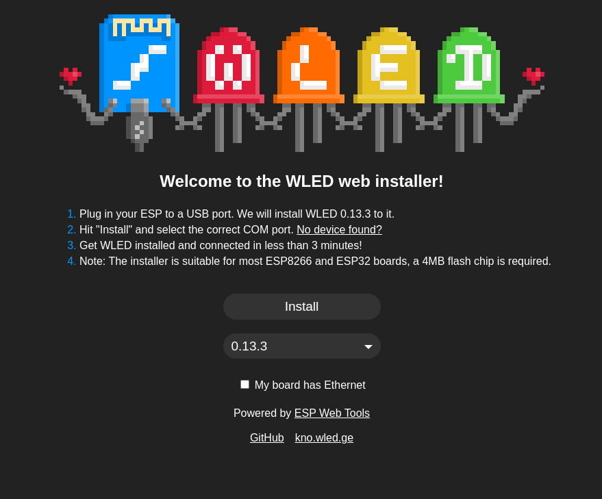
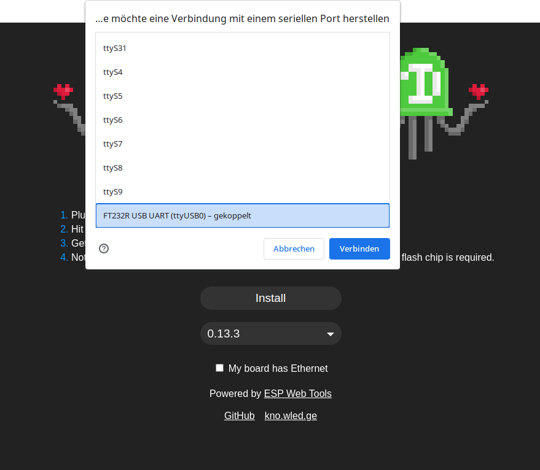
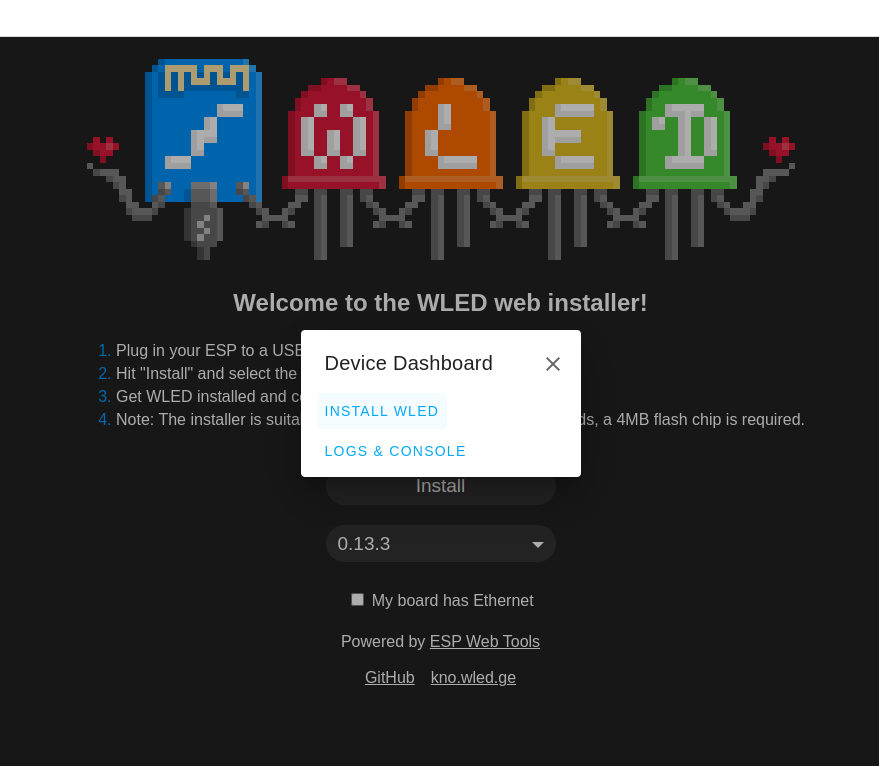
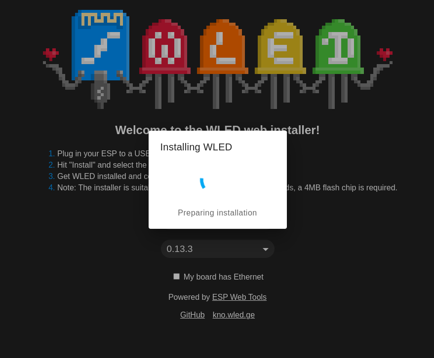
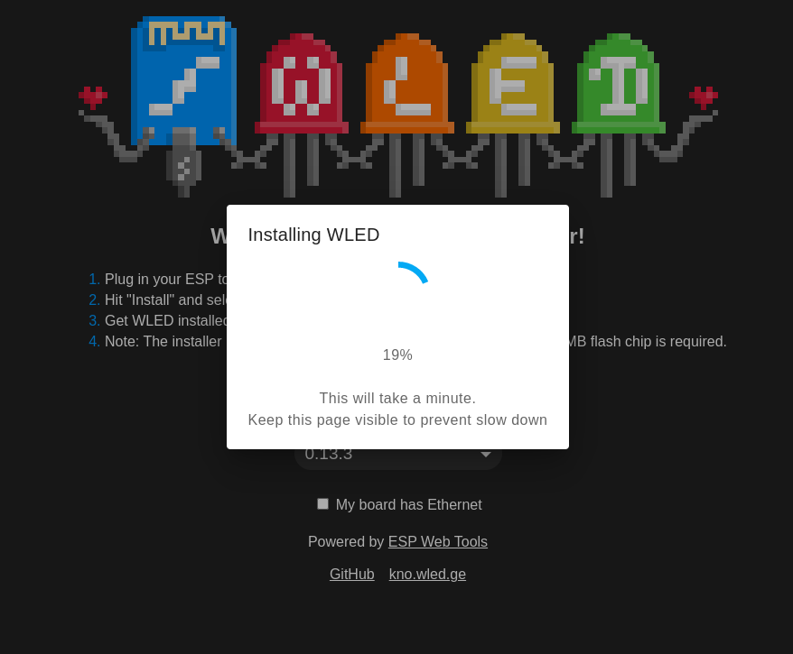
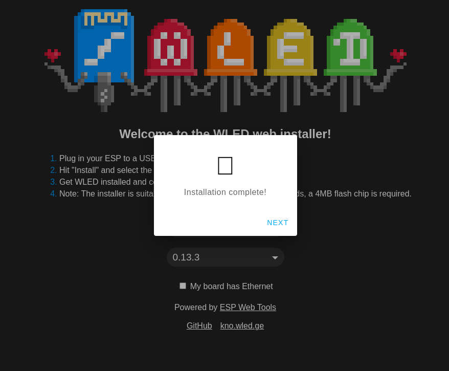

# Flashen des Controllers

Gehe mit Google Chrome/Chromium auf folgede Website  [install.wled.me](https://install.wled.me/) 

Wähle aus dem Drop-Down Menü das letzte Release aus. (Hier 0.13.3)

Wenn du Install klickst, wirst du nach dem Zugriff auf die serielle Schnittstelle gefragt. Welchen du mit "Verbinden" gewären musst.

Wenn nicht klar ist, welche Schnittstelle du brauchst, musst du unter Linux in /dev nachsehen und unter Windows im Gerätemanager unter "COM & LPT". Einfach den Controller vom USB trennen und wieder verbinden. Das was sich ändert ist der richtige Anschluss.

"Install WLED" anklicken. 

"Install" anklicken.

Warten.

Warten.

"NEXT" anklicken.

 
