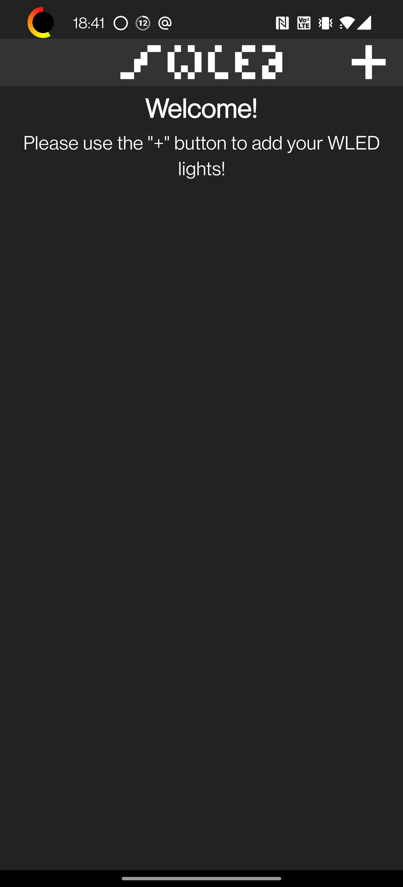
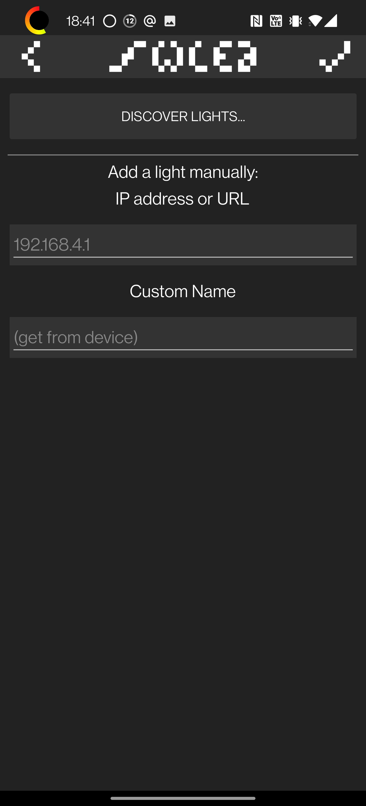
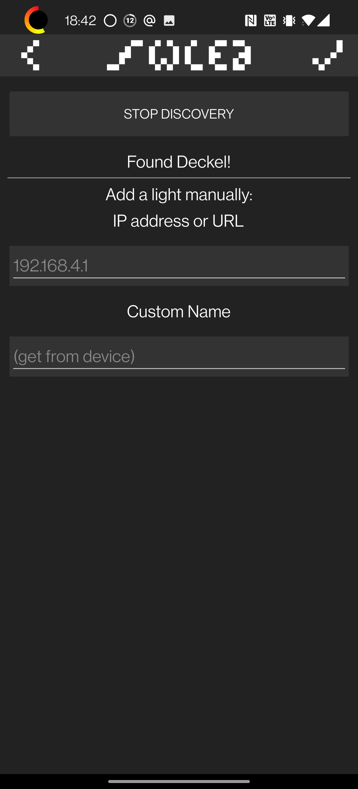
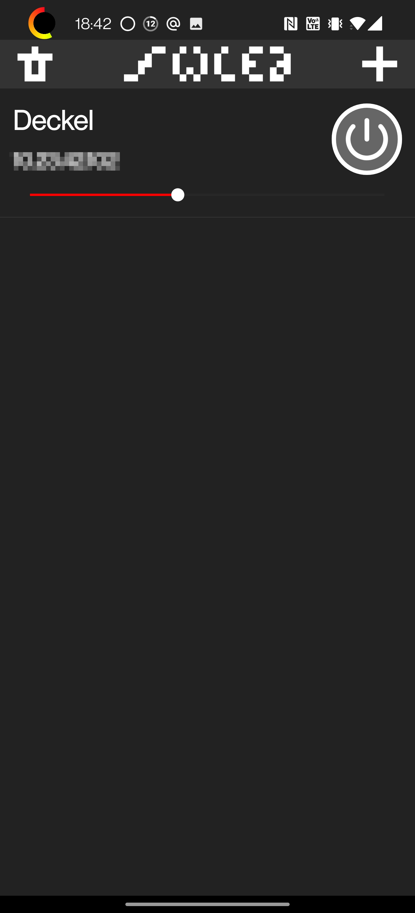
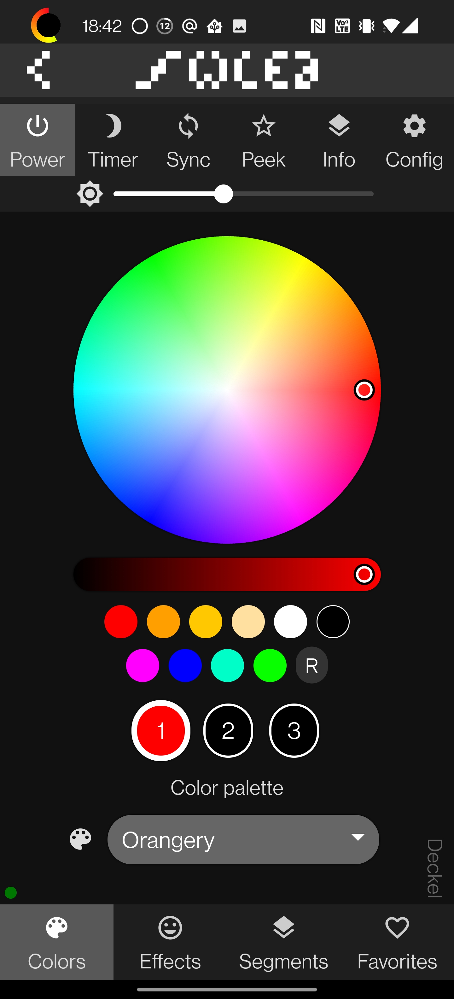

# WLED-Config

## Vorbereitung

Lade dir die WLED-APP von Aircookie herunter, die brauchst du später.

* [Playstore](https://play.google.com/store/apps/details?id=com.aircoookie.WLED&hl=de&gl=US) mit widerlichem Google
* [GitHub](https://github.com/Aircoookie/WLED-App/releases) ohne widerliches Google

## Konfiguration

### Smartphone mit WLED-AP verbinden

Der frisch geflashte und unkonfigurierte WLED-Controller sollte nach dem Einschalten ein paar der LEDs orange machen und ein WLAN Namens "WLED-AP" aufmachen. Verbinde dich damit und klicke auf "Im Netzwerk anmelden"!

Normalerweise wirst du nach dem Verbinden mit dem WLAN direkt auf die WLED Konfigurationsseite umgeleitet (Captive Portal). Wenn das nicht funktioniert, musst du im Browser die IP-Adresse "4.3.2.1" ansurfen.

Hier kannst du WLED ins heimische WLAN integrieren, oder direkt steuern:

Drücke "WIFI SETTINGS".

### WLED mit heimischem WLAN verbinden

Gib hier die Zugangsdaten für dein heimisches IoT WLAN an ;) (SSID und Passwort reicht).

Drücke danach "Save & Connect"

Der WLED Controller bootet und verbindet sich danach mit deinem heimischen WLAN.

Verbinde dein Smartphone mit deinem heimischen WLAN (wenn es das nicht schon selbst gemacht hat)!

### WLED Konfigurieren und Steuern

Starte die WLED App und drücke das "+" Symbol oben rechts

Drücke "Discover Lights"

Wenn dein WLED gefunden wurde, dann drücke den Haken rechts oben. Wenn nicht, dann hast du jetzt ein Problem.

In der Übersicht aller WLED Devices klicke auf das neu gebaute druff.

Klicke auf "Config" --> "LED Preferences". Hier musst du bei "LED count" die Anzahl der angeschlossenen WS28xx LEDs eintragen.

Bei "Color order" musst du die Farbreihenfolge der WS28xx einstellen:
* WS2811: RGB
* WS2812: GRB

Drücke auf Save. Die LEDs sollten nun ALLE orange leuchten. Wenn dem nicht so ist, dann hast du jetzt schon wieder ein Problem.
