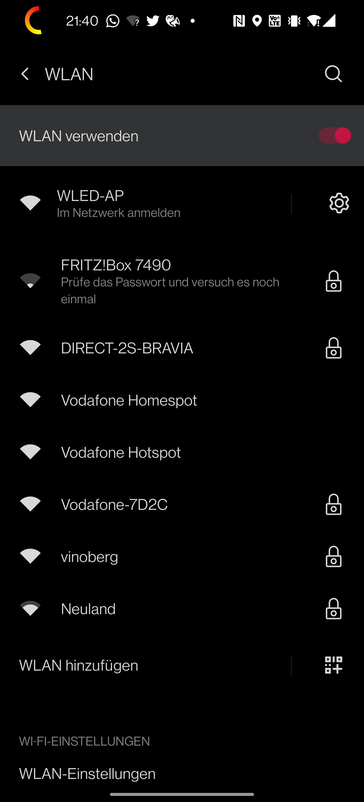
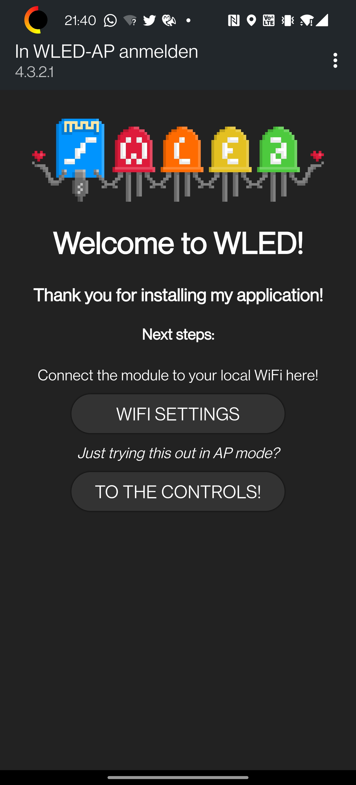
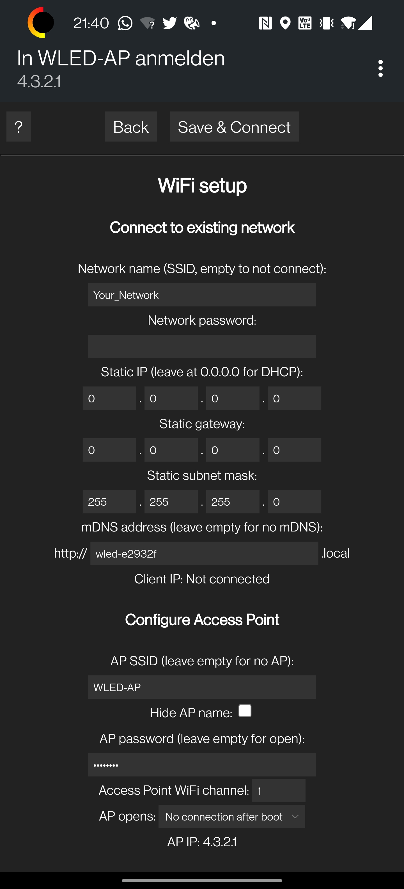

# WLED-Config

Nach dem Einschalten des ESP erscheint ein Access-Point mit dem Namen "WLED-AP". Verbinden!

Normalerweise wirst du nach dem Verbinden direkt auf die WLED Konfigurationsseite umgeleitet. Wenn das nicht funktioniert, musst du im Browser die IP-Adresse "4.3.2.1" eingeben.

Drücke "WIFI SETTINGS".

Gib hier die Zugangsdaten für dein heimeisches IoT WLAN an ;) .
SSID und Passwort reicht.

Drücke "Save & Connect"

Jetzt musst du dich wieder mit deinem heimischen WLAN verbinden und die WLED-APP herunterladen.

[Playstore](https://play.google.com/store/apps/details?id=com.aircoookie.WLED&hl=de&gl=US)

[GitHub](https://github.com/Aircoookie/WLED-App/releases) ohne widerliches Google

